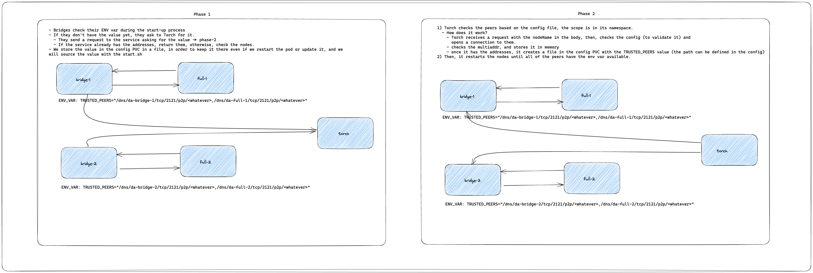

# Torch

## Description

Torch is the **Trusted Peers Orchestrator**.

Torch access to the nodes defined in the config file and get's their multiaddress, then, it writes it to the specified path and shares the info with all the other peers defined.

---

## Flow

Nodes side:
- Nodes check their `ENV` var during the start-up process
- If they don't have the value yet, they ask to Torch for it.
  - They send a request to the service asking for the value -> phase-2
  - If the service already has the addresses, return them, otherwise, check the nodes.
- We store the value in the config PVC in a file, to keep it there even if we restart the pod or update it, and we 
will source the value with the `start.sh`


1) Torch checks the peers based on the config file, the scope is in its namespace.
  - How does it work?
    - Torch receives a request with the nodeName in the body, then, checks the config (to validate it) and
      opens a connection to them.
    - checks the multiaddr, and stores it in memory
    - once it has the addresses, it creates a file in the config PVC with the TRUSTED_PEERS value (the path can be defined in the config)
2) Then, it restarts the nodes until all of the peers have the env var available.


---

## API Paths

- `/config`
  - **Method**: `GET` 
  - **Description**: returns the config added by the user, can be used to debug
- `/list`
  - **Method**: `GET`
  - **Description**: returns the list of the pods available in it's namespace based on the config file
- `/gen` 
  - **Method**: `POST`
  - **Description**: starts the process to generate the trusted peers on the nodes based on the config
  - **Body Example**: 
    ```json
    {
        "podName": "da-bridge-1"
    }
    ```
  - **Response Example**:
    ```json
    {
        "status": 200,
        "body": {
            "da-bridge-0": "/dns/da-bridge-0/tcp/2121/p2p/12D3KooWDMuPiHgnB6xwnpaR4cgyAdbB5aN9zwoZCATgGxnrpk1M"
        }
    }
    ```
- `/genAll`
  - **Method**: `POST`
  - **Description**: generate the config for all the peers in the config file
  - **Body Example**:
    ```json
    {
        "podName": 
        [
            "da-bridge-1",
            "da-full-1"
        ]
    }
    ```
  - **Response Example**:
    ```json
    {
        "status": 200,
        "body": {
            "da-bridge-0": "/dns/da-bridge-0/tcp/2121/p2p/12D3KooWDMuPiHgnB6xwnpaR4cgyAdbB5aN9zwoZCATgGxnrpk1M",
            "da-full-0": "/dns/da-full-0/tcp/2121/p2p/12D3KooWDCUaPA5ZQveFfsuAHHBNiAhEERo5J1YfbqwSZKtn9RrD"
        }
    }
    ```
---

## How does it work?

Here is an example of the flow, using the config:

```yaml
mutualPeers:
  - peers:
    - nodeName: "da-bridge-1"
      containerName: "da"
    - nodeName: "da-full-1"
      containerName: "da"
    trustedPeersPath: "/tmp"
  - peers:
    - nodeName: "da-bridge-2"
      containerName: "da"
    - nodeName: "da-full-2"
      containerName: "da"
    trustedPeersPath: "/tmp"
```



---